Application Programming Interfaces (APIs) are the way different applications communicate with one another. They represent the backbone for many products and services, and thus ensuring deployed APIs continually perform as intended is crucial for many consumers and businesses who rely on them.

API Connect Test and Monitor is a tool by IBM which provides free automated testing and monitoring of any publicly available API, requiring no code and minimal setup. In this tutorial, I will walk you through how to use the automated test generation feature within Test and Monitor to easily create a test for any public API endpoint. Moreover, I'll cover how to run this test on a schedule so you can continually monitor the state and quality of your API.

# Tutorial
### Setup
To get started you will need:
A free IBM Account to use with API Connect Test and Monitor.
A publicly available API to test.

### Creating Your First Test
For this tutorial I am going to be using the APIs provided by reqres.in to create a test, but you can use any publicly available API.

Step one is to [login to API Connect Test and Monitor](https://us-east.apitest.apiconnect.ibmcloud.com/app/). The first page you'll see is known as the **_HTTP Client_**. Here you can execute REST requests to different API endpoints, similar to as you would in Postman or Insomnia. You can choose your HTTP method from the dropdown, define your request URL, and add any headers or a body that's required for your request.

For my first test I want to assert I receive the correct response when performing a `GET` request to `https://reqres.in/api/users/1`. Typing this URL into the `Request url` box and hitting `Send` will execute the request. Upon receiving the response, Test and Monitor will display the result of this as parsed JSON below.

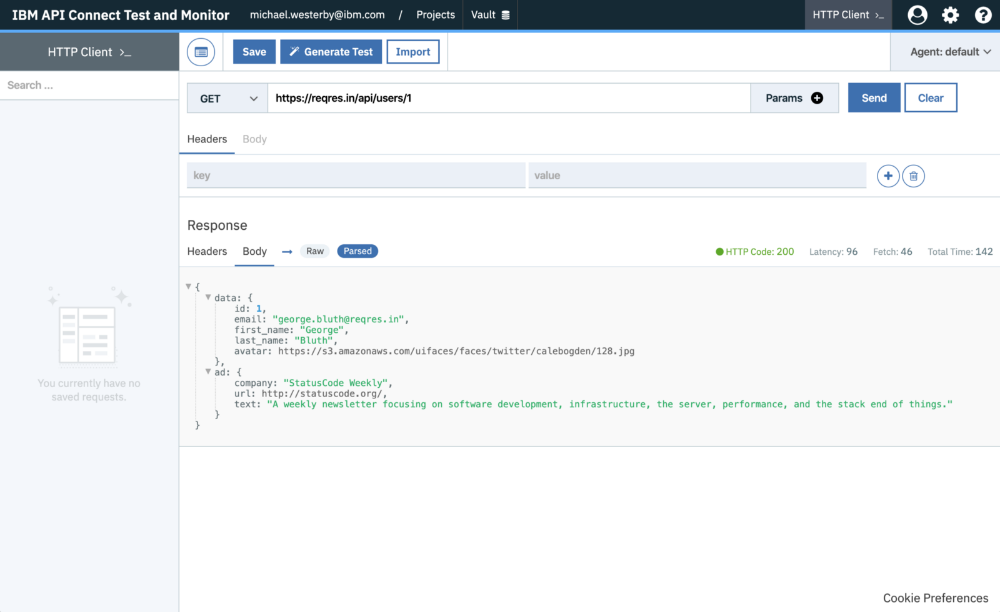

Now is a good time to check that the response shown is what you expect from this endpoint (_i.e._ is the data structure and values of the response correct), as this is what Test and Monitor will use to help generate our test. Once you've verified the response, click on the `Generate Test` button at the top of the page to start making out first test! You'll be asked to give your test a name, as well as to choose a project to save it to. Projects are a way Test and Monitor groups series of tests. If you don't have a project already, you can create one here by choosing `Create new project` and entering a name. You'll then be able to select this project for future tests you create.

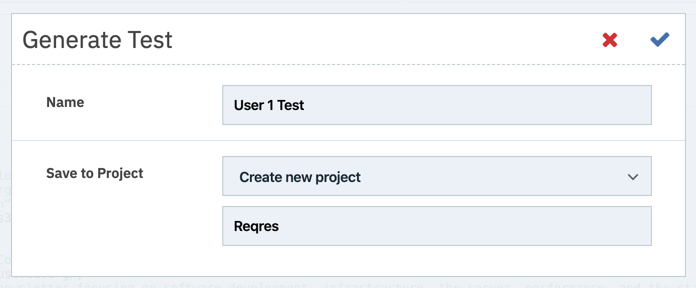

When you've given your test a name and assigned it to a project, click the check button to generate the test. Test and Monitor will now run though the response we received earlier and begin iterating over the payload, subsequently understanding the type of data that was received and determining what test assertions should be generated and parameters to create. You'll then be prompted with a screen saying "All set!" when this process has finished.

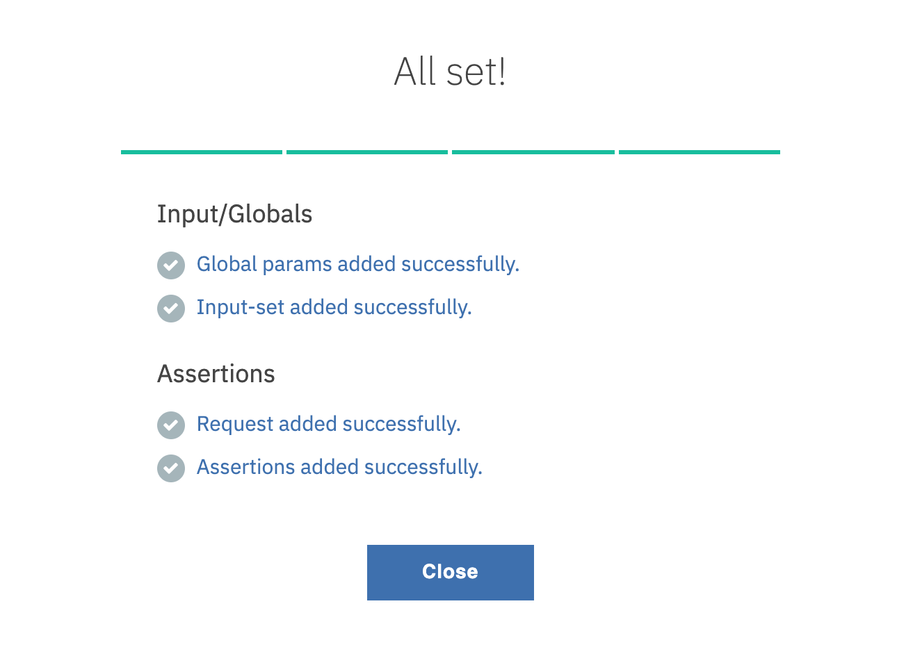

Click the `Close` button and you will now be presented with the generated test. This page is the drag-and-drop **_Test Composer_**. Each row represents an assertion that was generated from the response payload by Test and Monitor. For example, in my test below, it will be asserted that the response status code for this `GET` request is equal to `200` and that the `Content-Type` headers are equal to `application/json`. Moreover, for each item in the response body, Test and Monitor will assert that either these items exist or are of the correct type: _i.e._ `data.firstName` must exist, or `data.email` is a valid email address.

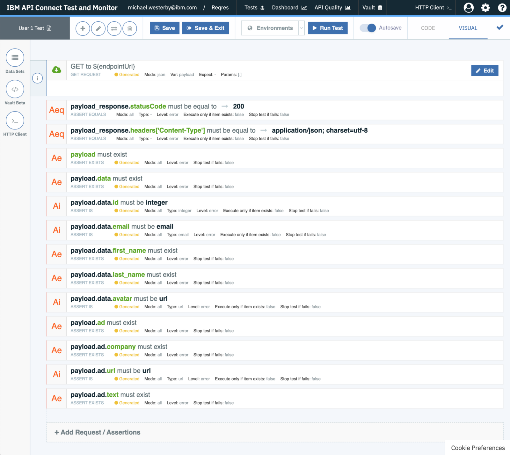

Each of these assertions is customisable and you can edit the _expression_ or _type_ that is being asserted should you desire. Furthermore, you can also add your own additional assertions by clicking the `+ Add Request / Assertions` button at the bottom of this screen. Have a look though the assertions that were generated for your endpoint, and if you're happy we can go ahead and verify our generated test by running it. Click on the `Run Test` button at the top, then choose the default `Agent` and click `Run Test`.

A new tab will open up showing the **_Test Report_** for the test we just ran. Here you can see a summary of the test results including the overall response (_i.e._ _"Test passed"_ in my case below) and how many assertion failures occurred. Towards the bottom of the report we can see in detail the status of each individual assertion that was defined in the _Test Composer_ in addition to other metrics such as the download speed and latency of the request.

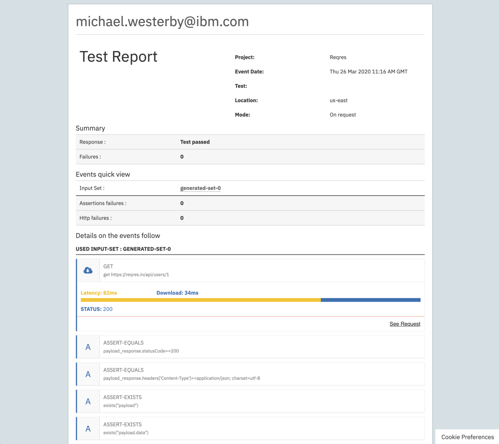

Congratulations! So far we've successfully generated and ran our first test in API Connect Test and Monitor. We're now ready to set up our test to run on a schedule so that we can continually monitor the state of our endpoint. Close the _Test Report_ tab and head back to the _Test Composer_. Now click the `Save & Exit` button at the top of the screen to save our test. You'll then be redirected to the **_Test Status_** page.

Until now, we have been editing a working copy of our test, thus at the top of this page our current test status is set to _"Draft"_. You will also note that the `Schedule` button is currently greyed out. To schedule a test we need to first publish the changes we've made to our working copy to a published version of the test. To do this, simply click the `Publish` button.

Once clicked, the test status will then change to _"Ready to be scheduled"_ and the `Schedule` button will now become active.

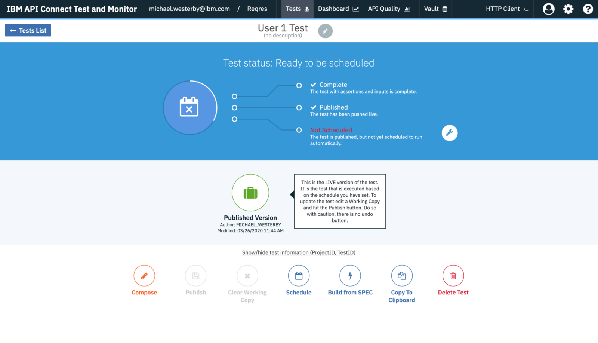

Click the `Schedule` button to begin scheduling our test. You will now be taken to the **_Scheduler_** page for your test. To schedule a test you need to create a new _Run_. A _Run_ defines a time schedule the test will be executed on, for example, once per hour, every day. Click the `+ Create New Run` button on the left hand side to begin making our new run.

To the right hand side of the screen a new run page will appear allowing us to fill in details about this new scheduled run. First, input a name for your run (I've called mine _"Hourly"_) and select the default agent to perform the test. Now, feel free to customise the frequency you wish for the test schedule to run on. I've chosen the 15th minute of every hour, of every day of every month. There are also options to be emailed if the test fails on a scheduled run, as well as to try again if the test fails. Enable these if you wish, however leave the `Paused` toggle _off_ as this will prevent the run from executing if enabled.

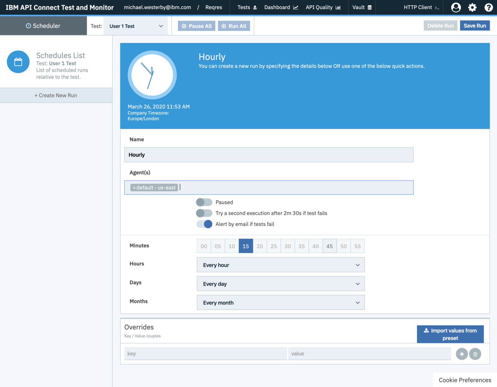

Once you're satisfied with your selection, click the `Save Run` button at the top right of the screen to save your run. You've now scheduled your first test!

### Viewing Your Test Runs
Now that we've created and scheduled our first test, we can take a step back and look at how we can monitor the results of this test as well as others that you make in the future. Click on `IBM API Connect Test and Monitor` in the top left of the screen to be taken to the **_Main Dashboard_**. Here you will see a dashboard comprised of all your projects. Note the project we made for our first test is now shown here ("_Reqres_" in my case). Underneath each Project card there are four options: **Dashboard, Tests, API Quality** as well as **Settings**. We will explore each of these further:

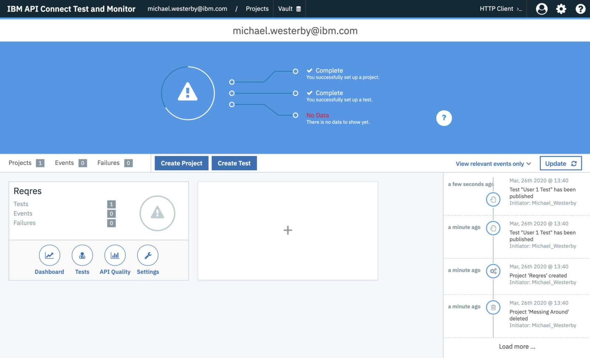

#### Dashboard
The Dashboard gives you an overview of all the events that have occurred in your project (where an event is an execution of a test, either manually or via a scheduled run). Here you can see the status of each event in your project including the date and time it was ran, and number of assertion failures that occurred. Below we can see the _User 1 Test_ we created has been executed three times, all of which have passed. Clicking on an event in the Events table will give you the option to view the test report for that event should you want to investigate this further.

#### Tests
The Tests option will list all the tests associated with the selected project (as well as give you the option to create new tests). Here you can see the _User 1 Test_ we created earlier is listed.

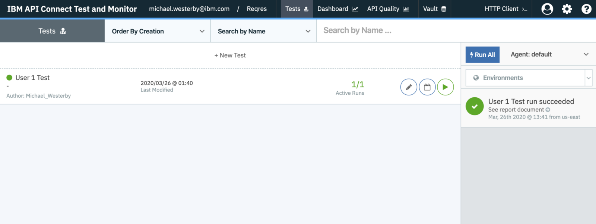

Next to each test you can see how many active runs there are. These are the number of runs you have scheduled for that test. As we created one run in the _Scheduler_ for this test and it is currently active, we will see `1/1 Active Runs`. In addition, you can edit a test by clicking on the pencil icon, which will take you back to the _Test Status_ page where you can then edit your test in the compose view. Additionally, we can view/edit the test run schedule by clicking on the calendar icon which will take you to _Scheduler_ for that test. You may also execute any test immediately in a project by clicking the play button next to that test.

#### API Quality
Similar to the Dashboard, the API Quality page shows you an overview of the status of the tests in your project. Here you can see a high level summary of how each test is performing in your project as well as its success ratio. In addition, you can track the how the results of your tests (and subsequently the quality of the API your testing) changes over the months.

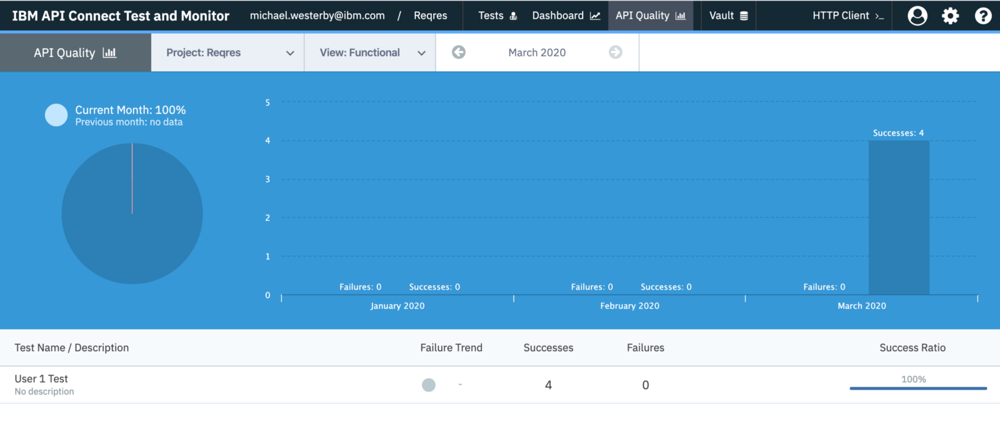

#### Settings
The settings option is where you can configure information about the project such as its name and description. _Note: to delete a project you will need to first remove all tests associated with it._

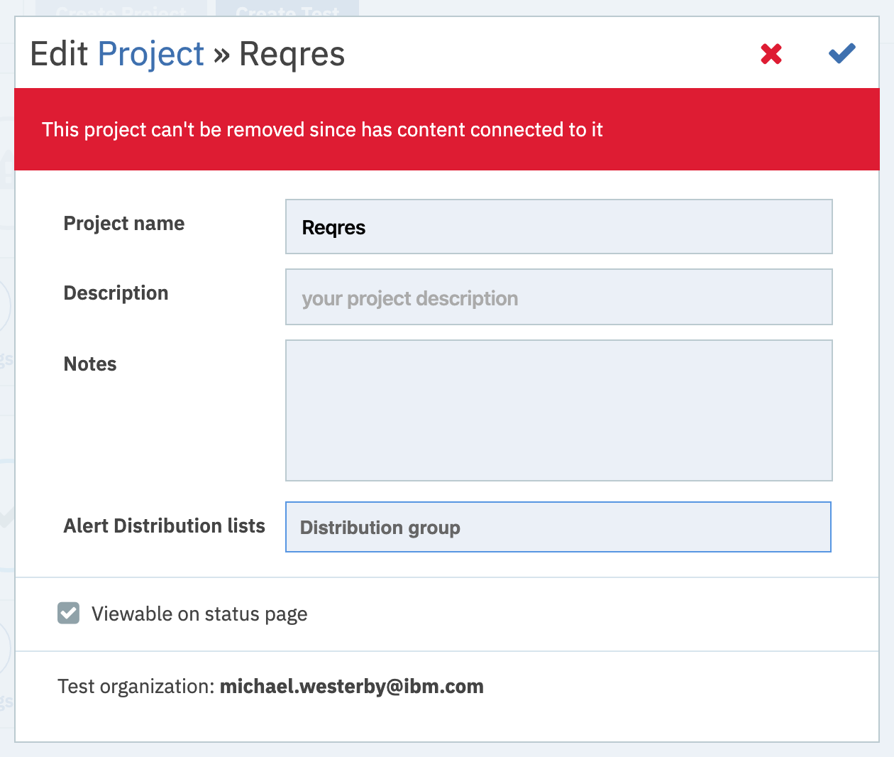

---

And that's it! You've successfully created and scheduled a test in IBM API Connect Test and Monitor. Feel free to have a play around and add even more tests to your project and watch as the dashboards begin populating with your test results! For more information about Test and Monitor, check out the [Developer Hub](https://us-east.apitest.apiconnect.ibmcloud.com/app/) where you can find links to our blog, docs and GitHub pages.